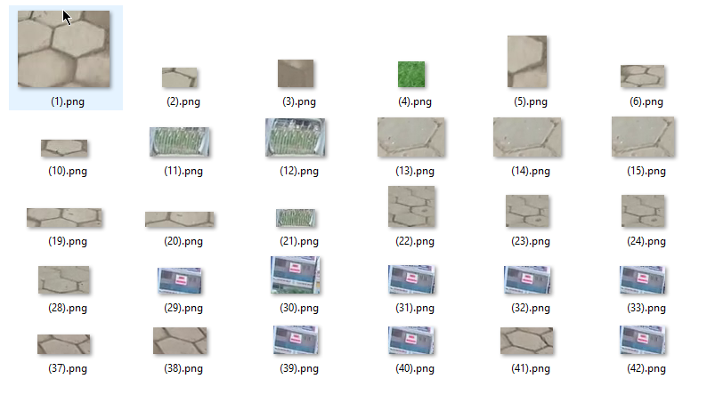

# Traffic signs detection and classification in real time


### 1. Description ###
This project is a traffic signs detection and classification system on videos using OpenCV.
The detection phase uses Image Processing techniques that create contours on each video frame and find all ellipses or circles among those contours. They are marked as candidates for traffic signs.

Detection strategy:
1. Increase the contrast and dynamic range of the video frame
2. Remove unnecessary colors like green with HSV Color range
3. Use Laplacian of Gaussian to display border of objects
4. Make contours by Binarization.
5. Detect ellipse-like and circle-like contours

In the next phase - classification phase, a list of images are created by cropping from the original frame based on candidates' coordinate. A pre-trained SVM model will classify these images to find out which type of traffic sign they are.

Currently supported traffic signs (*The name of each sign's file is corresponding to their class in SVM*):
 
Note:
- *All signs which belong to class 8 and above are marked as **OTHERS** because a competition requires this. There is also a class 0 which are marked as non-traffic-sign*
- *Only the **biggest** sign in the current frame is cropped and classified*

The SVM Model is trained each time the ```main.py``` called, before the detection phase but I still save the model in [data_svm.dat](data_svm.dat) to implement the model-reload function in the future to avoid retraining phase.

If a traffic sign is detected, it will be tracked until it disappears or there is another bigger sign in the frame. The tracking method is [Dense Optical Flow](https://docs.opencv.org/trunk/d7/d8b/tutorial_py_lucas_kanade.html).
### 2. Prerequisites:
- Python 3.5
- [OpenCV3](https://opencv.org/)
- Imutils (use```pip3 install imutils``` to install)

### 3. System structure
##### a. There are 3 python files as 3 modules:
- [main.py](main.py) :The start point of the program.
- [classification.py](classification.py) :SVM Model to classify traffic signs
- [common.py](common.py) :Functions for defining SVM Model

Other files:
- [data_svm.dat](data_svm.dat) : Saved SVM model after training.
- [README.md](README.md) : This file, obiviously 

##### b. [Dataset](dataset)
The [Dataset](dataset) folder contains images for training SVM models. There are 12 folders contains cropped images of traffic signs. Each folder is named as the class of the traffic signs it contains. The special [0](dataset/0) folder contains non-traffic-sign cropped images which can be recognized as traffic signs in the detection phase. 


The dataset is created by applying the detection phase on many videos with various parameters to mark all traffic signs and then manually separating them into their right classes.

Each time run the program, the dataset can be updated by checking all generated cropped images of detected traffic signs, then find all misclassified traffic signs.
### 4. Installation
#### There are two ways of running the program:
Use default arguments:
```sh
$python3 main.py
```
Use custom arguments: 
```sh
$python3 main.py
optional arguments:
  -h, --help            show this help message and exit
  --file_name FILE_NAME
                        Video to be analyzed
  --min_size_components MIN_SIZE_COMPONENTS
                        Min size component to be reserved
  --similitary_contour_with_circle SIMILITARY_CONTOUR_WITH_CIRCLE
                        Similarly to a circle
```
### 5. Result

### 6. Disadvantages
- Static image processing, this means parameters must be updated for each video with different lighting conditions
- The accuracy of the detection phase is not high, still, miss signs or detect wrong areas.
- The dataset is a little bit overfitting for classification phase. 
### 7. Future developments
- Better performance with higher framerate
- Use other approaches like YOLO or SSD
- Dynamic image processing
- Use CNN to classification
- No need to retrain the model when running the program
- Make a bigger dataset


### TIẾNG VIỆT
# Mô tả: Đây là một hệ thống nhận diện và phân loại biển báo giao thông trên video sử dụng OpenCV. Quá trình nhận diện sử dụng các kỹ thuật xử lý ảnh để tạo ra các đường viền trên mỗi khung hình video và tìm tất cả các hình elip hoặc hình tròn trong các đường viền đó. Các hình này được đánh dấu là ứng viên cho biển báo giao thông.

# Cấu trúc hệ thống:
Có 3 tệp Python là 3 modules chính: main.py, classification.py, và common.py.
- [main.py](main.py): Điểm bắt đầu của chương trình.
- [classification.py](classification.py) :SVM Mô hình phân loại biển báo giao thông
- [common.py](common.py): Các hàm xác định Mô hình SVM
Những tập tin khác:
- [data_svm.dat](data_svm.dat): Đã lưu mô hình SVM sau khi huấn luyện.
- [README.md](README.md): Rõ ràng là tập tin này
- thư mục Dataset chứa hình ảnh cho việc huấn luyện mô hình SVM.

Thư mục [Dataset](dataset) chứa các hình ảnh để huấn luyện mô hình SVM. Có 12 thư mục chứa hình ảnh biển báo giao thông đã được cắt xén. Mỗi thư mục được đặt tên theo loại biển báo giao thông mà nó chứa. Thư mục đặc biệt [0](dataset/0) chứa các hình ảnh bị cắt không phải biển báo giao thông có thể được nhận dạng là biển báo giao thông trong giai đoạn phát hiện.


Tập dữ liệu được tạo bằng cách áp dụng giai đoạn phát hiện trên nhiều video với nhiều thông số khác nhau để đánh dấu tất cả các biển báo giao thông, sau đó tách chúng thành các lớp phù hợp theo cách thủ công.
Mỗi lần chạy chương trình, tập dữ liệu có thể được cập nhật bằng cách kiểm tra tất cả hình ảnh đã cắt của các biển báo giao thông được phát hiện, sau đó tìm tất cả các biển báo giao thông bị phân loại sai.

# Yêu cầu:
Python 3.5
OpenCV3
Imutils

# Cài đặt:
Có hai cách chạy chương trình: sử dụng các đối số mặc định hoặc sử dụng đối số tùy chỉnh.

Kết quả: Hình ảnh minh họa kết quả của hệ thống nhận diện và phân loại biển báo giao thông trên video.

# Nhược điểm:
-Xử lý ảnh tĩnh, điều này có nghĩa là các tham số phải được cập nhật cho mỗi video với các điều kiện ánh sáng khác nhau.
-Độ chính xác của quá trình nhận diện không cao, vẫn bỏ sót biển báo hoặc phát hiện các khu vực sai.

# Cải tiến trong tương lai:
-Hiệu suất tốt hơn với tốc độ khung hình cao hơn.
-Sử dụng các phương pháp khác như YOLO hoặc SSD.
-Xử lý ảnh động.
-Sử dụng CNN để phân loại.
-Không cần phải huấn luyện lại mô hình khi chạy chương trình.
-Tạo ra một tập dữ liệu lớn hơn.


[classification.py](classification.py)
File này chứa mã nguồn cho việc huấn luyện mô hình SVM để phân loại các biển báo giao thông dựa trên hình ảnh. Dưới đây là tóm tắt các phần chính:
- Import thư viện và định nghĩa tham số: Import các thư viện cần thiết như OpenCV, NumPy, Matplotlib và định nghĩa các thông số như kích thước ảnh (SIZE) và số lượng lớp biển báo giao thông (CLASS_NUMBER).
- Hàm load_traffic_dataset(): Hàm này tải dữ liệu từ các tệp hình ảnh trong thư mục dataset và chuyển chúng thành các mảng dữ liệu (dataset) và nhãn (labels) tương ứng với mỗi loại biển báo.
- Hàm deskew(): Hàm này sử dụng để làm phẳng hình ảnh.
- Class StatModel và SVM: Các lớp này được sử dụng để tải và lưu mô hình SVM. Mô hình SVM được sử dụng để phân loại hình ảnh biển báo giao thông sau khi đã được huấn luyện.
- Các hàm training(), getLabel(): Hàm training() được sử dụng để huấn luyện mô hình SVM sử dụng dữ liệu từ hàm load_traffic_dataset() và các đặc trưng HOG (Histogram of Oriented Gradients). Hàm getLabel() được sử dụng để dự đoán nhãn của một hình ảnh biển báo giao thông sử dụng mô hình SVM đã được huấn luyện.

[common.py](common.py):
File này chứa các hàm và lớp phổ biến được sử dụng bởi các mã mẫu khác trong OpenCV. Dưới đây là tóm tắt các phần chính:
- Các hàm tiện ích:
splitfn(fn): Phân tách đường dẫn tệp thành thư mục, tên tệp và phần mở rộng.
anorm2(a), anorm(a): Tính toán độ lớn của vector.
homotrans(H, x, y): Áp dụng phép biến đổi đồng nhất cho một điểm.
to_rect(a), rect2rect_mtx(src, dst): Chuyển đổi giữa hai hình chữ nhật.
lookat(eye, target, up): Tính toán ma trận biến đổi từ một hệ thống tọa độ camera.
mtx2rvec(R): Chuyển ma trận xoay thành vector quay.
draw_str(dst, target, s): Vẽ một chuỗi ký tự lên ảnh.
make_cmap(name, n=256): Tạo một bản đồ màu từ một tên màu và số lượng giá trị màu.

- Các lớp:
Bunch: Lớp dùng để tạo đối tượng từ các cặp tên - giá trị được truyền vào dưới dạng đối số.
Sketcher: Lớp để vẽ trên ảnh sử dụng chuột.
RectSelector: Lớp để chọn hình chữ nhật trên ảnh bằng chuột.
StatValue: Lớp để tính giá trị thống kê (ví dụ: trung bình động).

-Các hằng số và hàm tiện ích khác:
image_extensions: Danh sách các phần mở rộng tệp hình ảnh.
nothing(*arg, **kw): Hàm rỗng.
clock(): Hàm trả về thời gian hiện tại.
Timer: Context manager để đo thời gian thực thi.
Và các hàm tiện ích khác như draw_keypoints, mosaic, grouper, mdot.


[main.py](main.py):
Tập lệnh Python được cung cấp là một chương trình để phát hiện và vị trí hóa biển báo giao thông trong video. Dưới đây là một tóm tắt về các thành phần chính và chức năng của nó:
- Thư viện được Import:Chương trình import các thư viện cần thiết như cv2, numpy, matplotlib.pyplot, imutils, argparse, os, và math.
- Hằng số: Chương trình định nghĩa một danh sách các nhãn biển báo giao thông gọi là SIGNS.
- Các Hàm Tiền Xử Lý Ảnh:
    + constrastLimit: Áp dụng cân bằng lược đồ histogram để tăng cường độ tương phản của ảnh.
    + LaplacianOfGaussian: Áp dụng bộ lọc Laplacian của Gaussian để phát hiện cạnh.
    + binarization: Thực hiện nhị phân hóa để tạo ra một ảnh nhị phân.
- Các Hàm Phát Hiện Biển Báo:
    + removeSmallComponents: Loại bỏ các thành phần nhỏ từ ảnh nhị phân.
    + findContour: Tìm các đường viền trong ảnh nhị phân.
    + contourIsSign: Xác định xem một đường viền có đại diện cho một biển báo không dựa trên chữ ký của nó.
    + cropContour và cropSign: Cắt ra biển báo đã phát hiện từ ảnh gốc.
- Các Hàm Chính:
    + localization: Định vị và nhận dạng biển báo giao thông trong mỗi khung hình của video.
    + remove_other_color: Loại bỏ các màu khác ngoài màu xanh, trắng và đen khỏi ảnh.
    + main: Hàm chính xử lý video đầu vào, phát hiện biển báo giao thông, theo dõi chúng và lưu video đầu ra.
- Phân Tích Tham Số Trên Dòng Lệnh:
    Chương trình sử dụng argparse để phân tích các đối số trên dòng lệnh cho tệp video đầu vào, kích thước tối thiểu của các thành phần, và ngưỡng tương đồng cho việc phát hiện đường viền.
- Xử Lý Video:
    Chương trình đọc video đầu vào từng khung hình một, xử lý từng khung hình để phát hiện và định vị biển báo giao thông, và ghi video đầu ra với hộp giới hạn xung quanh các biển báo phát hiện được.
- Output:
    Chương trình lưu video đã xử lý thành output.avi và ghi thông tin biển báo phát hiện được vào một tệp văn bản có tên là Output.txt.


# Laplacian of Gaussian (LoG)
Laplacian of Gaussian (LoG) được sử dụng để phát hiện cạnh trong ảnh. Đây là một kỹ thuật phổ biến trong xử lý ảnh để làm nổi bật các cạnh và biên của các đối tượng trong hình ảnh.

Cụ thể, quá trình LoG bắt đầu bằng việc áp dụng một bộ lọc Gaussian để làm mờ hình ảnh ban đầu. Bộ lọc này giúp loại bỏ nhiễu và tạo ra một phiên bản mượt mà của hình ảnh. Sau đó, một bộ lọc Laplacian được áp dụng vào hình ảnh đã làm mờ. Bộ lọc Laplacian này giúp nhấn mạnh các sự thay đổi đột ngột trong độ sáng của hình ảnh, do đó tạo ra các cạnh và biên.

Trong source code, quá trình Laplacian of Gaussian được thực hiện bằng các hàm của thư viện OpenCV như sau:
    LoG_image = cv2.GaussianBlur(image, (3, 3), 0)
    gray = cv2.cvtColor(LoG_image, cv2.COLOR_BGR2GRAY)
    LoG_image = cv2.Laplacian(gray, cv2.CV_8U, 3, 3, 2)
    LoG_image = cv2.convertScaleAbs(LoG_image)

Ở đây:
cv2.GaussianBlur() được sử dụng để làm mờ hình ảnh ban đầu bằng bộ lọc Gaussian với một kernel có kích thước (3, 3) và độ lệch chuẩn là 0.
cv2.Laplacian() áp dụng bộ lọc Laplacian vào hình ảnh đã làm mờ để tạo ra hình ảnh LoG.
cv2.convertScaleAbs() được sử dụng để chuyển đổi hình ảnh LoG thành hình ảnh dạng unsigned 8-bit.

Kết quả của quá trình LoG là một hình ảnh với các cạnh và biên nổi bật, từ đó giúp trong việc phát hiện và nhận dạng các đối tượng trong hình ảnh.


# SVM (Support vector machine)
Trong đoạn mã trên, mô hình SVM được sử dụng để phân loại các hình ảnh đã được trích xuất các đặc trưng HOG (Histogram of Oriented Gradients) từ các biển báo giao thông. Dưới đây là cách hoạt động của mô hình SVM:

- Load và lấy dữ liệu: Đầu tiên, dữ liệu được tải từ thư mục dataset và chia thành các mẫu huấn luyện và kiểm tra. Mỗi mẫu được biểu diễn bằng một vectơ đặc trưng HOG.

- Huấn luyện mô hình: Dữ liệu huấn luyện được sử dụng để huấn luyện mô hình SVM. Trong quá trình huấn luyện, các vectơ đặc trưng HOG được đưa vào mô hình cùng với nhãn tương ứng (loại biển báo). SVM học cách phân biệt các loại biển báo dựa trên các đặc trưng HOG này.

- Dự đoán: Sau khi huấn luyện, mô hình SVM có thể được sử dụng để dự đoán loại biển báo của các hình ảnh mới. Để làm điều này, các đặc trưng HOG của các hình ảnh mới được trích xuất và đưa vào mô hình SVM. Mô hình SVM sau đó dự đoán loại biển báo của từng hình ảnh dựa trên các đặc trưng này.

- Đánh giá: Kết quả dự đoán từ mô hình SVM được đánh giá để đánh giá hiệu suất của mô hình. Độ chính xác của mô hình được tính toán bằng cách so sánh nhãn dự đoán với nhãn thực tế của các hình ảnh kiểm tra. Confusion matrix cũng được tạo ra để xem xét sự phân loại của mô hình trên từng loại biển báo.

- Lưu mô hình: Sau khi huấn luyện và đánh giá, mô hình SVM có thể được lưu vào một tệp để sử dụng sau này mà không cần huấn luyện lại từ đầu. Điều này giúp tiết kiệm thời gian và công sức khi triển khai mô hình trong các ứng dụng thực tế.


# trích xuất đặc trưng
Trong các đoạn mã, có hai phương pháp quan trọng để trích xuất đặc trưng từ hình ảnh là HOG (Histogram of Oriented Gradients) và LOG (Laplacian of Gaussian).

- Histogram of Oriented Gradients (HOG):
    + Trong các đoạn mã, hàm get_hog() được sử dụng để khởi tạo đối tượng HOG descriptor với các tham số được chỉ định trước.
    + Đối tượng HOG descriptor được tạo ra từ các tham số như kích thước cửa sổ (winSize), kích thước ô (cellSize), kích thước block (blockSize), số lượng bin histogram (nbins) và các tham số khác.
    + Sau đó, mỗi hình ảnh đầu vào được chuyển đổi thành biểu diễn HOG bằng cách sử dụng phương thức compute() của đối tượng HOG descriptor.
    + Kết quả là một vectơ đặc trưng HOG cho mỗi hình ảnh, được sử dụng trong quá trình huấn luyện và dự đoán của mô hình SVM.

- Laplacian of Gaussian (LOG):
    + Trong hàm LaplacianOfGaussian(image) trong đoạn mã, hình ảnh đầu vào trước tiên được làm mờ bằng bộ lọc Gaussian để giảm nhiễu và tăng cường kết cấu.
    + Sau đó, hình ảnh được chuyển đổi sang ảnh đen trắng và được áp dụng bộ lọc Laplacian để phát hiện cạnh.
    + Kết quả là một hình ảnh cạnh đã được phát hiện, trong đó các đặc trưng cạnh quan trọng được nổi bật và sẽ được sử dụng trong quá trình xử lý hình ảnh tiếp theo, chẳng hạn như việc xác định vùng quan trọng hoặc phân loại các đối tượng.# Traffic_Sign_Detection

